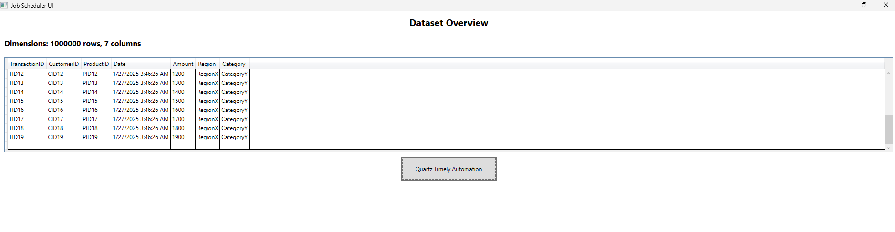
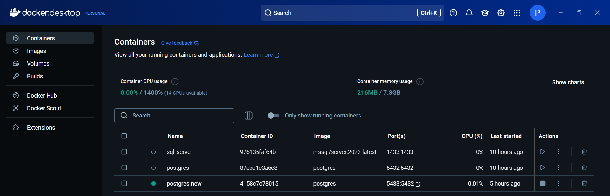
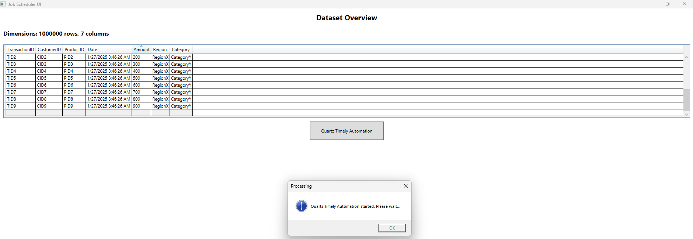
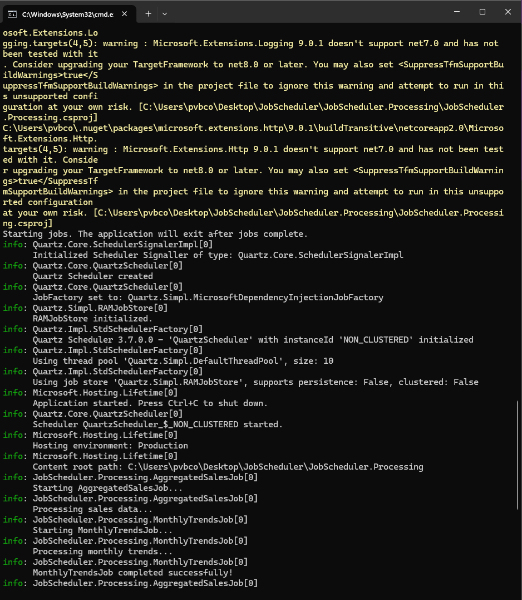
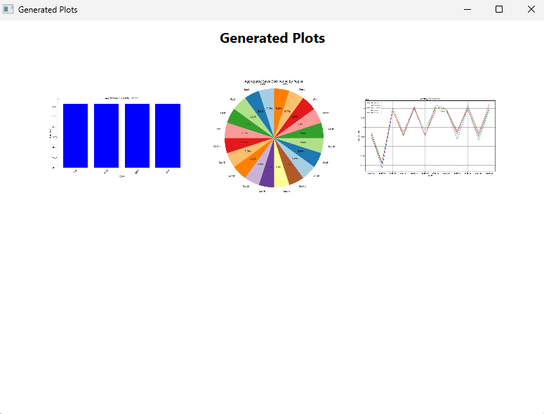

# Quartz.NET-Automation-Pipeline

## Overview
This comprehensive end-to-end project leverages the power of Quartz.NET Automation Framework to handle and process large-scale datasets exceeding 10 million records. Built with C# and .NET, the system demonstrates enterprise-level data processing capabilities while maintaining high performance and reliability. The project showcases the seamless integration between .NET's robust backend processing and Flask's visualization capabilities, all wrapped in a user-friendly WPF interface.

## Features

### .NET UI with WPF
* Displays dataset dimensions and a preview of the first 20 rows
* Provides a simple and intuitive user interface
* Button-triggered workflow for automation
* Dynamically displays the generated plots (bar chart, pie chart, and line chart)

### Quartz.NET Scheduler
* Executes processing tasks like AggregatedSalesJob and MonthlyTrendsJob
* Multi-threaded, scheduled execution of tasks with logs displayed in a separate terminal
* Handles task scheduling and timely automation

### Flask API for Plot Generation
* Generates bar charts, pie charts, and line charts based on processed data
* Saves the plots in a predefined directory (/JobScheduler/JobScheduler/plots)
* Returns HTTP responses to confirm successful plot generation

### Visualizations
* **Aggregated Sales:**
  * Bar Chart: Total sales by region
  * Pie Chart: Distribution of sales by region
* **Monthly Trends:**
  * Line Chart: Sales growth trends for various categories

### Dynamic Workflow
* Workflow starts upon clicking the "Quartz Timely Automation" button in the UI
* Real-time updates with the terminal logs for ongoing tasks
* Seamless display of plots in the UI once tasks are completed

## Project Structure
```
JobScheduler/
├── JobScheduler.Integration/
├── JobScheduler.Processing/
│   ├── AggregatedSalesJob.cs
│   ├── MonthlyTrendsJob.cs
│   ├── FlaskApiServiceJob.cs
│   ├── Program.cs
│   ├── Models.cs
│   ├── AppDbContext.cs
├── JobScheduler.UI/
│   ├── App.xaml
│   ├── App.xaml.cs
│   ├── MainWindow.xaml
│   ├── MainWindow.xaml.cs
│   ├── DataWindow.xaml
│   ├── DataWindow.xaml.cs
├── flask_app.py
├── plots/
│   ├── 1.png
│   ├── 2.png
│   ├── 3.png
├── JobScheduler.sln
```

## Workflow

### Step 1: Dataset Overview
* The UI initializes by showing:
  * Dataset dimensions (number of rows and columns)
  * A preview of the first 20 rows of the StagingData table

### Step 2: Start Automation
* Click the Quartz Timely Automation button
* The Quartz.NET job scheduler starts in a new terminal window
* The terminal logs display real-time progress of:
  * AggregatedSalesJob: Processes sales data
  * MonthlyTrendsJob: Analyzes monthly trends

### Step 3: Flask API Integration
* Once the jobs complete, data is sent to the Flask API:
  * Endpoint /plot/aggregated-sales generates bar chart and pie chart
  * Endpoint /plot/monthly-trends generates line chart

### Step 4: Display Results
* The UI transitions to a new window showing:
  * Bar Chart: Aggregated sales by region
  * Pie Chart: Sales distribution by region
  * Line Chart: Monthly sales trends by category

## Prerequisites

### Development Tools
* .NET SDK 7.0 or higher
* Python 3.10 or higher
* Visual Studio or any C#-compatible IDE

### Required Python Libraries
* Flask
* Matplotlib

Install them using:
```bash
pip install flask matplotlib
```

### Directory Setup
* Ensure the project structure is intact
* Plots will be stored in: /JobScheduler/JobScheduler/plots

## How to Run

### Step 1: Start the Flask API
Navigate to the project root and start the Flask server:
```bash
python flask_app.py
```

### Step 2: Run the .NET Solution
1. Open the JobScheduler.sln solution in Visual Studio
2. Set the UI Project (JobScheduler.UI) as the startup project
3. Run the project

## File Explanations

### 1. JobScheduler.Processing/Program.cs
* Handles Quartz.NET job scheduling:
  * AggregatedSalesJob: Processes sales data for generating charts
  * MonthlyTrendsJob: Analyzes monthly sales trends

### 2. Flask API (flask_app.py)
* Generates visualizations from processed data
* Saves plots as 1.png, 2.png, and 3.png

### 3. JobScheduler.UI/MainWindow.xaml.cs
* Displays the initial dataset overview
* Initiates the Quartz.NET process

### 4. JobScheduler.UI/DataWindow.xaml.cs
* Displays the generated plots in the UI

## Logging and Debugging

### Quartz.NET Logs
* View detailed logs in the terminal opened by JobScheduler.Processing
* Logs include real-time updates of task execution

### Flask API Logs
* View logs in the terminal running flask_app.py
* Logs include HTTP requests and responses

## Known Issues
* **Tkinter Warnings:** While running Flask with Matplotlib, GUI-related warnings may appear
* **Path Configurations:** Ensure the plotDirectory in C# matches the correct path

## Future Enhancements
* Add More Visualizations: Include additional charts like scatter plots or histograms
* Real-Time Updates: Implement live data streaming
* Multi-User Support: Enhance the system for concurrent users

## Execution Snapshots







## Project Structure

# Quartz.NET-Automation-Pipeline
